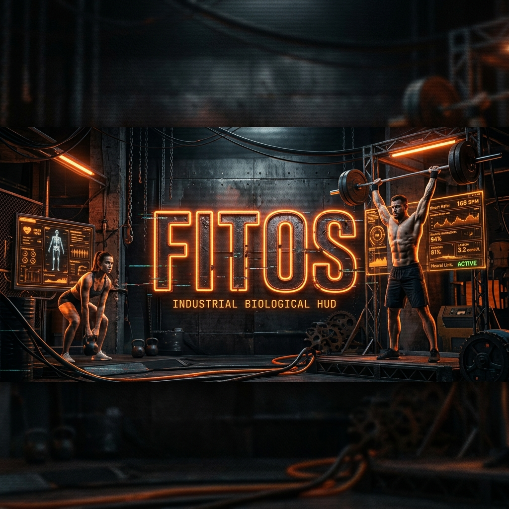

# FITOS // BIOLOGICAL HYPER-HUD

> [!IMPORTANT]
> **SYSTEM STATUS: ONLINE // METABOLIC ADAPTIVITY: PEAK**
> FitOS is not a fitness tracker. It is a real-time biological command console designed for high-intensity night-shift athletes and bio-hackers.

---

## 📟 CORE DIAGNOSTICS

### 🧬 Metabolic Adaptability Score (MAS)
A mission-critical metric that calculates your biological adherence to the 24/7 cycle. It monitors water intake, nutrient timing, and neural recovery to provide a live optimization score from 0-100.

### 📟 Cyber-Terminal Console
An integrated diagnostic logger that provides real-time sub-system updates:
- `SYS.METABOLIC > LIPID_BURN: ACTIVE`
- `SYS.CORE > CORTISOL: STABLE`
- `SYS.NEURAL > DRIVE: READY`

### ⚡ Neural Drive Monitoring
Advanced cross-referencing of training volume and recovery status to predict CNS (Central Nervous System) fatigue. Features dynamic **DELOAD** alerts and **GO HARD** indicators.

---

## 🎨 INDUSTRIAL AESTHETIC (HUD v4)

FitOS features a "Grit & Glitch" industrial UI designed for high-focus environments:
- **Digital Scanlines:** Hardware-level CRT effect.
- **Dynamic Phase Borders:** Borders shift color based on your current Metabolic Phase (Oxidation / Anabolic / Recovery).
- **Slam-In Transitions:** Heavy, tactile UI animations for a hardcore experience.

---

## 🚀 SYSTEM INITIALIZATION

1. **BOOT SEQUENCE:** `git clone https://github.com/MihirBodana3011/FitOs-Fitness.git`
2. **MAINTENANCE:** Navigate to root and run a local server (e.g., Live Server).
3. **CALIBRATION:** Open the dashboard and input your biological baseline (Weight, Height, Age).

---

> [!CAUTION]
> **UNAUTHORIZED ACCESS DETECTED:** Proceed only if you are ready to push past your biological limits. 

---
Developed by **Mihir Bodana // AI Engineered by Antigravity**
